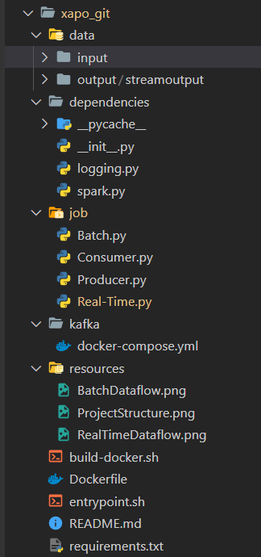
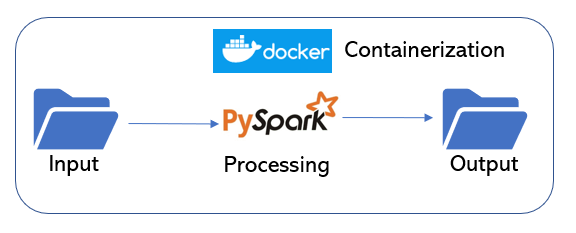

## Data Engineering Challenge

This repo explains the data engineering pipeline for Batch and Real time use-cases. The application has been dockerized for the ease of deployment.

_**Tool stack used:**_
  |Tool|Version  |
|--|--|
| Spark | 3.x |
| Python| 3.7.x |
| Docker| 19.03.6 |
| Java| 1.8.x |

 ## Project set up
 
 
 
 
 - data - Contains input data required for processing
 - dependencies - Python code for setting Spark session and Logger 
 - job - Application code to perform Logic processing
 - build-docker.sh - Builds the Dockerfile and runs the docker container
 - Dockerfile - For setting up Docker container
 - entrypoint.sh - Script that runs when docker container is instantiated, This runs the spark-submit internally.
 - kakfa - Config file for creating Kafka container with Broker and Zookeeper

## **Batch Use-case**
_**Use-case**_
 For the batch use-case, the data pipeline ingests source CSV files,
   runs the business logic using Pyspark and writes the output as CSV to
   the desired folder structure.
   
 _**Input files:**_
 1. card.csv - Details about the cards 		 
 2. card_instance.csv - Details of card instances 
 3. card_instance-shipping - Card shipping details 
 4. transactions.csv - Details of transactions done using the card
 5. currency.csv - This is file added to bring transaction amount to a  
    unified currency (EUR)
		 
 _**Data Flow:**_
 
 

_**Code Execution:**_

 - Clone the git repo
    ```sh
    git clone https://github.com/ajiks143/xapo.git
    ```   
 - Go respective project folder
    ```sh
    cd xapo
    ```
 - Run the shell script to Build and run docker container
    ```sh
    ./build-docker.sh <Docker Image name> <Mount path of Local>
    ```

    

    

 
